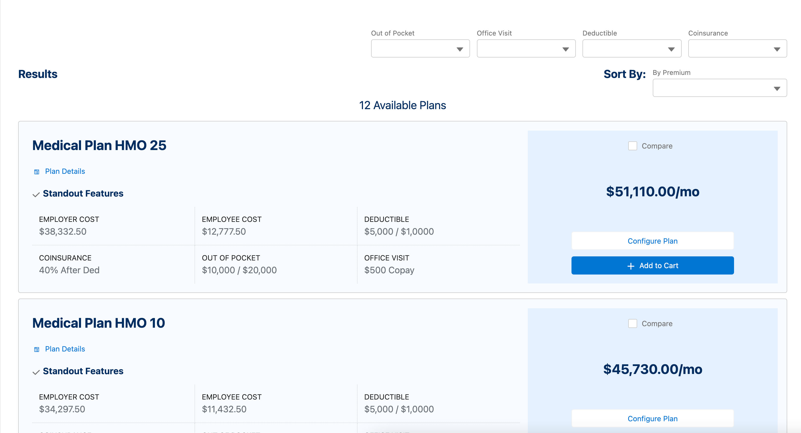
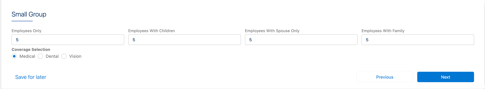
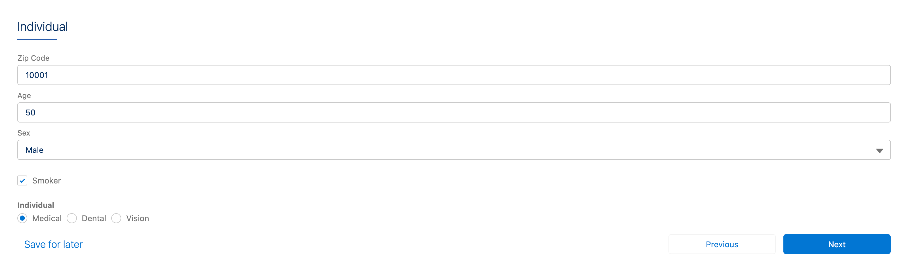
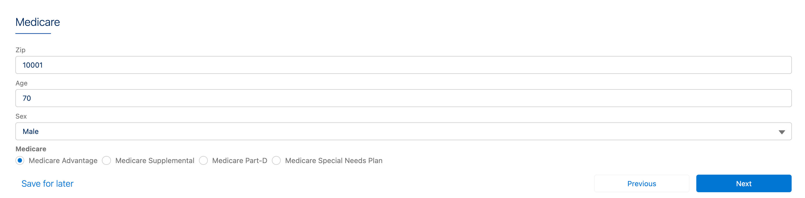
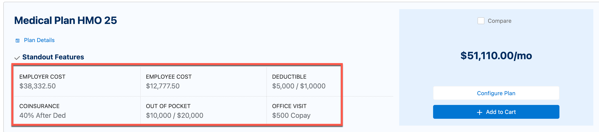

# A-HLS Payer Product Grid 


## Overview

insOsGridProductSelection LWC is designed for underwriters, brokers, and sales executives who select the products, compare and add them to the cart for the final purchase. 

A complex LWC called [insOsGridProductSelection](https://help.salesforce.com/s/articleView?id=ind.v_health_t_use_the_insosgridproductselection_lwc_482515.htm&type=5)  is used to provide this function as part of Vlocity Insurance package (vlocity_ins). In this HLS Accelerator we want show how to use this component with a set of detail extensive example. 

This accelerator does not cover how to create products. Before you start with this It's recommended that you start with the product's data pack and add the product data pack to your org https://github.com/healthcare-and-life-sciences/ins-products 

We have created sampe pricing engines that shows how to use [Expression sets](https://help.salesforce.com/s/articleView?id=sf.expression_sets.htm&type=5) for pricing but these are example EP's that are not real pricing engines. Again the idea here is to show how the data is passed between the product grid and expression set, not to implement an actual pricing engin. 

Following in an example of the proudct grid that shows with product data. 





When you look at the sample Omniscript, you will see depending on the type of insurance (Small Group, Invidual, Medicare), a user can input different data and they are passed to the expression set. Follwoing values show different data we capture based on teh type of insurance. 











### JSON Configuration . 

How to configure the LWC json is described here [insOsGridProductSelection](https://help.salesforce.com/s/articleView?id=ind.v_health_t_use_the_insosgridproductselection_lwc_482515.htm&type=5) at a high level. Here are some brake down that explains bit more. Follwing is a example configuration JSON for the LWC


``` json
{
  "bStandalone": false,
  "conditionType": "Hide if False",
  "controlWidth": 12,
  "customAttributes": [
    {
      "name": "pre-filter",
      "source": "%medicalFilters%"
    },
    {
      "name": "census-json",
      "source": ""
    },
    {
      "name": "concurrent-batch-request",
      "source": "3"
    },
    {
      "name": "load-batch-size",
      "source": "1"
    },
    {
      "name": "max-compare-products",
      "source": "4"
    },
    {
      "name": "sort-field",
      "source": "GroupPremiumEmployer:Premium"
    },
    {
      "name": "show-product-tile",
      "source": "true"
    }
  ],
  "disOnTplt": false,
  "filtersConfig": {
    "inPageFilters": [
      "SG_annualOOP_INN:Out of Pocket",
      "SG_primaryCare_INN:Office Visit",
      "SG_annualDed_INN:Deductible",
      "SG_coinsurance_INN:Coinsurance"
    ],
    "serviceFilters": {
      "SubType__c": {
        "attributeLabel": "Sub Type",
        "attributeName": "SubType__c",
        "attributeObject": "vlocity_ins__SubType__c",
        "listOfValues": [
          {
            "label": "HMO",
            "value": "HMO"
          },
          {
            "label": "PPO",
            "value": "PPO"
          }
        ]
      },
      "Tier__c": {
        "attributeLabel": "Tier",
        "attributeName": "Tier__c",
        "attributeObject": "vlocity_ins__Tier__c",
        "listOfValues": [
          {
            "label": "Gold",
            "value": "Gold"
          },
          {
            "label": "Silver",
            "value": "Silver"
          },
          {
            "label": "Bronze",
            "value": "Bronze"
          }
        ]
      }
    }
  },
  "hide": false,
  "initAction": {
    "className": "InsProductService",
    "inputMap": {
      "userInputs": {
        "VH-SG-Census-RF.SG_empOnlyCount": "%SmallGroup:EmpOnlyCount%",
        "VH-SG-Census-RF.SG_empChildrenCount": "%SmallGroup:EempChildrenCount%",
        "VH-SG-Census-RF.SG_empSpouseCount": "%SmallGroup:EmpSpouseCount%",
        "VH-SG-Census-RF.SG_empFamilyCount": "%SmallGroup:EmpFamilyCount%",
        "VH-SG-Census-RF.SG_CM_Age": 40,
        "VH-SG-Census-RF.SG_CA_RatingType": "Average",
        "VH-SG-Census-RF.VisContribution": 50,
        "VH-SG-Census-RF.MedContribution": 75,
        "VH-SG-Census-RF.DenContribution": 50,
        "VH-SG-Census-RF.SG_totalDependents": "0",
        "VH-SG-Census-RF.SG_primaryMember": "true"
      }
    },
    "methodName": "getEligibleProducts",
    "optionsMap": {
      "filters": "vlocity_ins__Type__c:%InsuranceType%,vlocity_ins__MarketSegment__c:%InsurancePlan%",
      "rootPricingOnly": true,
      "ruleAttributeSetValues": false
    }
  },
  "label": "LWCinsOsGridProductSelectionMedicalTile",
  "lwcName": "vlocity_ins__insOsGridProductSelection",
  "productConfig": {
    "config": {
      "None": {
        "attributes": [
          {
            "fields": [
              "GroupPremiumEmployer"
            ],
            "label": "Employer Cost",
            "width": 1
          },
          {
            "fields": [
              "GroupPremiumEmployee"
            ],
            "label": "Employee Cost",
            "width": 1
          },
          {
            "fields": [
              "SG_annualDed_INN"
            ],
            "label": "Deductible",
            "width": 1
          },
          {
            "fields": [
              "SG_coinsurance_INN"
            ],
            "label": "Coinsurance",
            "width": 1
          },
          {
            "fields": [
              "SG_annualOOP_INN"
            ],
            "label": "Out of Pocket",
            "width": 1
          },
          {
            "fields": [
              "SG_primaryCare_INN"
            ],
            "label": "Office Visit",
            "width": 1
          }
        ]
      }
    },
    "fieldKeyName": "Family",
    "placeholders": [
      {
        "isHidden": false,
        "label": "Find A Dentist",
        "url": "https://www.google.com/"
      },
      {
        "isHidden": false,
        "label": "Summary of Benefits",
        "url": "https://www.yahoo.com/"
      },
      {
        "isHidden": false,
        "label": "Find A Dentist In San Francisco",
        "url": "https://www.google.com/"
      }
    ]
  },
  "rePriceAction": {
    "className": "InsProductService",
    "methodName": "rePriceProduct",
    "optionsMap": {
      "evalOptionalCoverageRelationship": true,
      "includeRawCalculationResult": true
    },
    "vlocityAsync": true
  },
  "show": null
}
```


and now we will go through each part of the json and explain what each root node does. 

**ProductConfig** 

The following JSON

```json
"productConfig": {
    "config": {
      "None": {
        "attributes": [
          {
            "fields": [
              "GroupPremiumEmployer"
            ],
            "label": "Employer Cost",
            "width": 1
          },
          {
            "fields": [
              "GroupPremiumEmployee"
            ],
            "label": "Employee Cost",
            "width": 1
          },
          {
            "fields": [
              "SG_annualDed_INN"
            ],
            "label": "Deductible",
            "width": 1
          },
          {
            "fields": [
              "SG_coinsurance_INN"
            ],
            "label": "Coinsurance",
            "width": 1
          },
          {
            "fields": [
              "SG_annualOOP_INN"
            ],
            "label": "Out of Pocket",
            "width": 1
          },
          {
            "fields": [
              "SG_primaryCare_INN"
            ],
            "label": "Office Visit",
            "width": 1
          }
        ]
      }
    }
```


Is used to display Standout Features on the LWC




## Business Objective

Show as an example of using insOsGridProductSelection LWC

## Business Value and Benefits

* Faster time to market

* * *

## Industry Focus and Workflow

### Primary Industry:

* Health Insurance

### Primary User Persona:

* Developers

* * *

## Package Includes:

### **OmniScript (#)**

* ProductGrid.json

* * *

## Configuration Requirements

### Pre-Install Configuration Steps:

1. Install Vlocity Insurance (vlocity_ins)
1. Please make sure you have installed sample HLS Insurance products https://github.com/healthcare-and-life-sciences/ins-products

#### Install the Data Pack

1. The Data Pack folder in the following GitHub repository contains one (1) DPA Data Pack. Please download the Data Pack and save them to your desktop: https://github.com/healthcare-and-life-sciences/ins-products-grid . Its named ProductGrid.json. This is an omniscript. 

2. Then, complete the following steps to import them into your Salesforce org.
    1. To Import, in your destination Salesforce org, Click on **App Launcher** → Search for '**OmniStudio DataPacks**' and click on it.
    2. Click on '**Installed**' and on the right side click on '**Import from**'.
    3. Select '**From File**' - When the window opens, select the Data Pack file that you downloaded and stored on your machine. Click '**Install**'.
    
    

### Post-Install Configuration Steps:

1. Activate the OS and you should be able to see the product grid based on different insurance plans you select.

* * *

## Assumptions

1. A customer has licenses for Health Cloud, and the HINS Managed Package with OmniStudio. These solutions have all been installed and are functional.
2. A customer is assuming Salesforce Lightning Experience — not Classic.
3. Data Model elements that are part of the HINS (Vlocity) Managed package and Health Cloud are all available.
4. The Accelerator uses the Lightning Design System standards and look. Customers may want to apply their own branding which can be achieved.

* * *

## Revision History

* **December 23, 2022**
* Inistial check in with support for Small Group, Invidiual and Medicare

* * *

